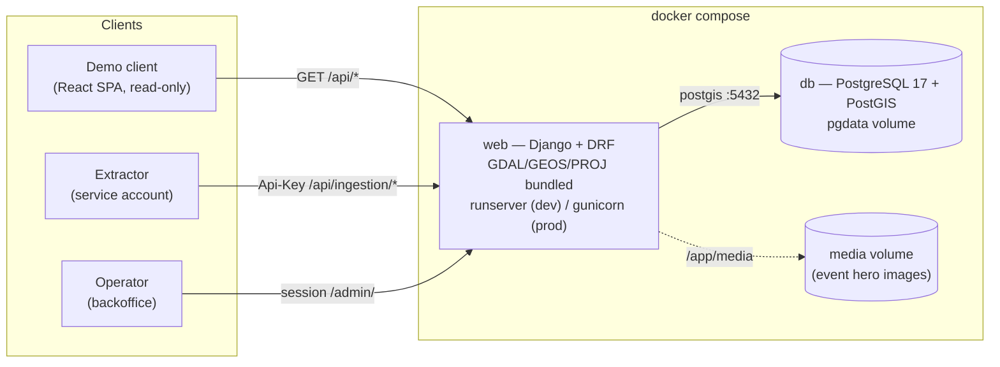
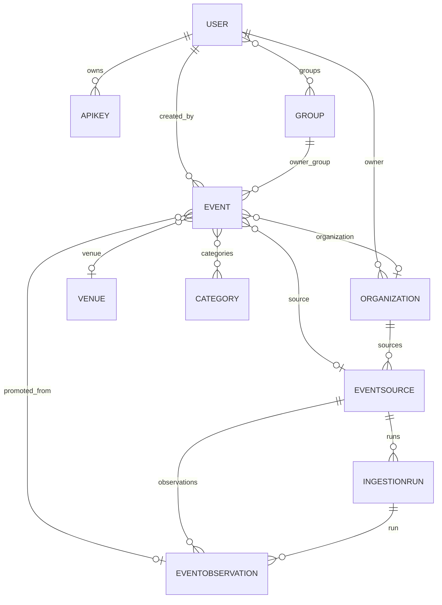
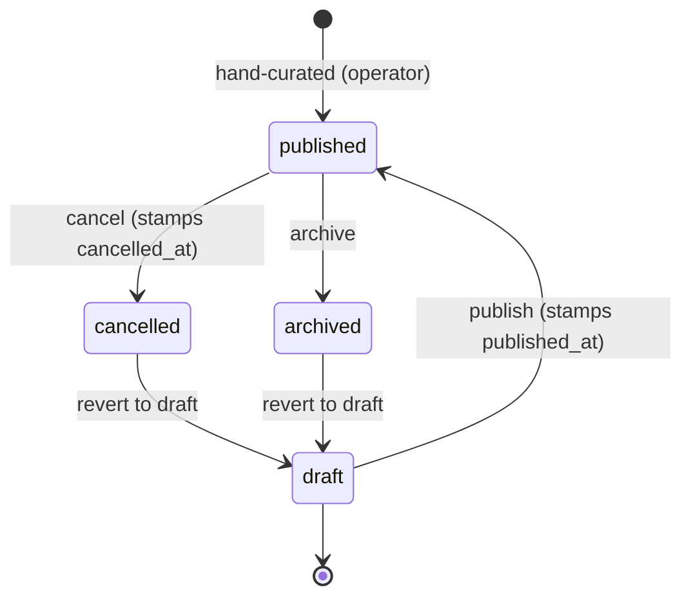
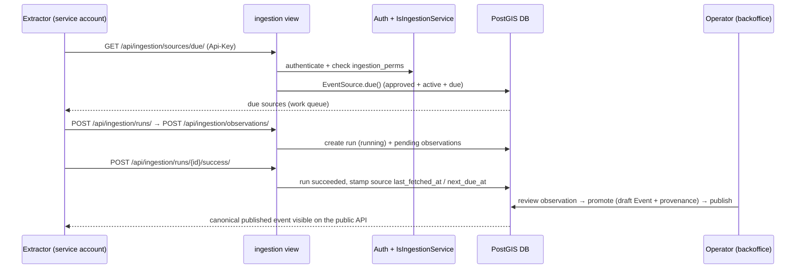
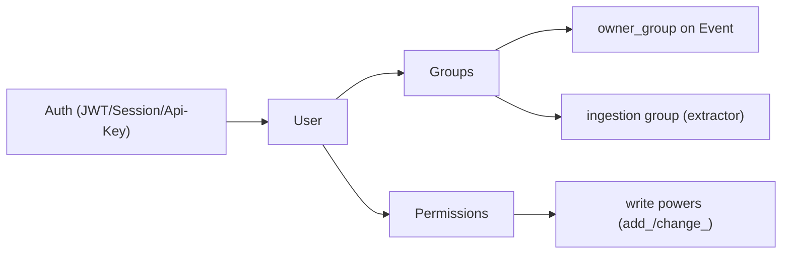
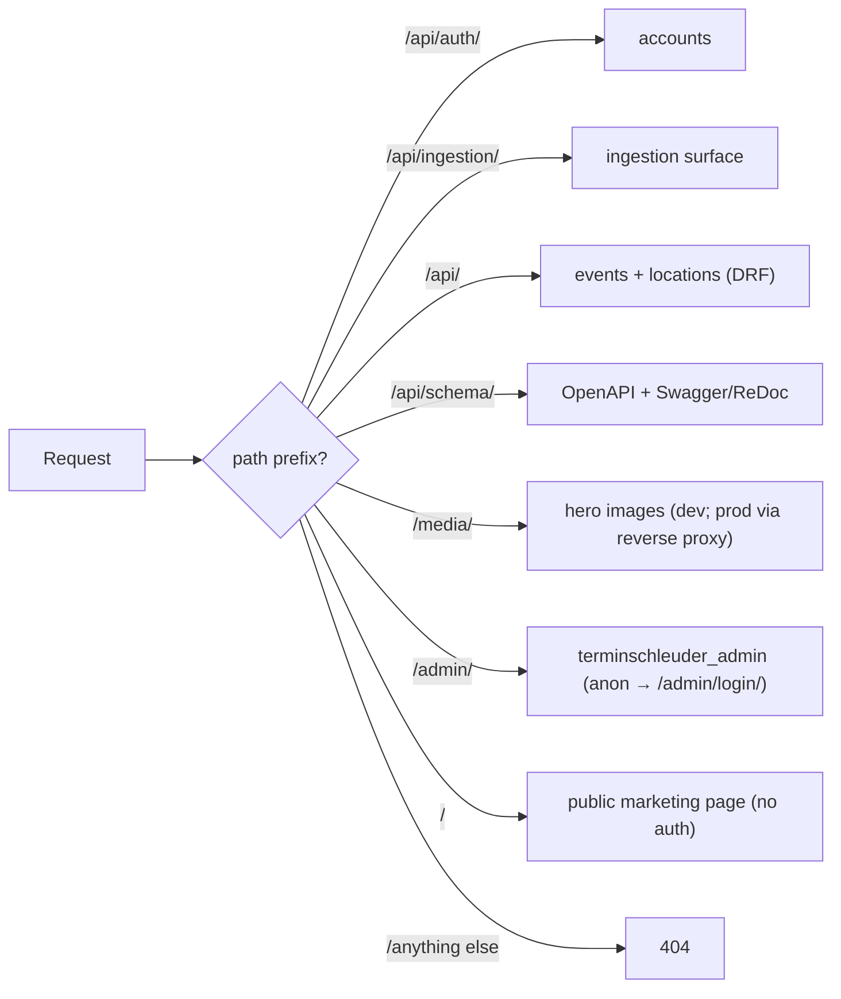

<!-- This file is **Marp-formatted Markdown** (open in VS Code with the "Marp for VS Code" extension, or run `npx @marp-team/marp-cli@latest terminschleuder-overview.md -o slides.pdf` to export). It also reads fine as a plain document on GitHub / Obsidian — mermaid diagrams render there. Each `---` is a slide break; `#` is the slide title. -->

# terminschleuder

### A geospatial events discovery platform

**Architecture & domain walkthrough**

<br>

> _"Find events, wherever you are."_

A backend that is the **system of record** for a catalog of local events and meetups,
lets clients discover events **by location** (near a point or near a city), and
**ingests** events from an external extraction pipeline with full **provenance**.

---

# What problem does this solve?

Consumers want to answer one question: **"what events are happening near me?"**

- Events live scattered across **many source sites** (meetup pages, community calendars,
  organizer homepages) — no single catalog.
- A client doesn't know coordinates — it knows **a city name**.
- Trust matters: crawled data is **untrusted**. Someone must review before it's published.
- Ownership matters: organizations own their events and sources.

**terminschleuder** is the backend that turns that mess into a single, clean,
location-queryable **read-only REST API**.

<!-- The framing: there are really two halves — (1) serve a clean public catalog queryable by location, and (2) safely build that catalog from untrusted scraped data. -->

---

# The one idea to hold onto

There are **two ways an event enters the system**:

1. **Hand-curated** — an operator creates it directly in the backoffice (or via the
   events API). It starts life **published**.
2. **Ingested** — the extractor submits an **untrusted observation**; an operator reviews
   it and **promotes** the good ones into a **draft** canonical event, then **publishes**
   it.

> **Observations can never touch a canonical event directly.**
> That trust boundary is the whole point of the ingestion pipeline.

This distinction — *trusted* `Event` vs *untrusted* `EventObservation` — shapes the entire
data model and every API surface.

---

# High-level architecture



- **web** — the Django app; all dev, tests, and prod run **inside the container**.
- **db** — PostgreSQL 17 with the PostGIS extension; `pgdata` volume persists data.
- **media volume** — persists generated hero images at `/app/media`, served at `/media/`.

---

# The deployment constraint: no GIS on the host

`django.contrib.gis` loads **GDAL / GEOS / PROJ** from the system. The deployment target
does **not** allow installing system packages — in production the machine *"can only pull
the image of this app."* This single constraint drives the whole runtime shape:

- The **app image bundles** GDAL/GEOS/PROJ (installed via `apt` in `Dockerfile`).
- The **database runs PostGIS** (a custom `postgres:17` + postgis image, `Dockerfile.db`).
- The **host never runs the app directly** — dev, tests, and prod all run inside containers.
- Production deploys by **pulling the image**; no host provisioning of GIS libraries.

> Consequence: you never run `manage.py` or `pytest` on your laptop — always
> `docker compose exec/run web …`. Prod only pulls the image.

<!-- This is why everything is containerized: it's not a stylistic choice, it's a hard deployment constraint. -->

---

# Apps (project layout)

| App | Responsibility |
| --- | -------------- |
| `config` | Django project: settings, root URL conf, WSGI/ASGI, pagination class. |
| `events` | Canonical events, venues, organizations, categories; **ingestion & provenance**; event lifecycle; proximity search; ownership permissions. |
| `accounts` | Users, service/system accounts, API keys, JWT views, registration. |
| `locations` | City gazetteer (catalog + `?near_city=` resolution); seeded from GeoNames. |
| `admin` | Human backoffice: a custom `AdminSite` at `/admin/`. Service-account & API-key issuance, promotion, event lifecycle. App label `backoffice`. |

The ingestion surface (`ingestion_views.py` / `ingestion_urls.py` / `ingestion_serializers.py`)
lives **inside `events`** — not a separate app — to avoid a cross-app migration cycle on
`Event.source` / `Event.promoted_from`.

---

# Domain glossary

- **Event** — the *trusted*, canonical, published record exposed to consumers.
- **EventObservation** — an *untrusted* extracted event; never mutates an `Event` directly.
- **Venue** — a physical place where events happen (name, address, city, location).
- **Organization** — an entity that owns event sources and the canonical events extracted from them (formerly *Organizer*).
- **Category** — a tag for events (e.g. "Music", "Tech").
- **EventSource** — a URL owned by an organization that the extractor crawls.
- **IngestionRun** — one extraction pass over a source, *reported* by the extractor.
- **Promote** — the operator action that turns an accepted observation into a **draft** canonical event with provenance.
- **Provenance** — the trail: where an event came from (source, original URL, platform, promoted-from observation).
- **City (gazetteer)** — a catalog of populated places that resolves `?near_city=` to a centroid + radius.

---

# Core domain model



> `City` is **independent** of the event graph — it's a gazetteer used to resolve
> `?near_city=<slug>` to a centroid + radius.

---

# Event — the trusted record

| Field | Notes |
| --- | --- |
| `title`, `description`, `starts_at`, `ends_at` | `starts_at` indexed asc + desc |
| `venue` (FK), `organization` (FK), `categories` (M2M) | nullable / optional |
| `location` | PostGIS `Point(geography, SRID 4326)`, nullable — centroid for proximity |
| `hero_image` | ImageField; file in the `media` volume, only path in DB; absolute URL read-only |
| `status` | `draft` / `published` / `cancelled` / `archived` (default `published`) |
| `event_type` | `meetup` / `conference` / `workshop` / `social` / `other` |
| `attendance_mode` | `physical` / `online` / `hybrid` (**online excluded from proximity**) |
| `original_url`, `original_platform` | provenance — where it was first seen |
| `source` (FK EventSource), `promoted_from` (FK EventObservation) | provenance links |
| `created_by` (FK User), `owner_group` (FK Group) | ownership |

New events default to **published / physical / other** with null provenance, so the
hand-curated catalog stays public. An index on `(status, starts_at)` backs the public
"published events, soonest first" listing.

---

# Event lifecycle

An event moves `draft → published → (cancelled | archived)`, reversible to `draft`.



- Driven from the **backoffice** list actions or the matching **API actions**
  (`POST /api/events/<id>/publish/`, `/cancel/`, `/archive/`).
- Only **`published`** events are visible to anonymous users of the public API; an owner
  may retrieve their own draft.

<!-- Note the deliberate two-step for ingested events: promote → draft, then a separate publish decision. -->

---

# The ingestion pipeline (the trust boundary)



The extractor **never writes a canonical `Event`** — it only reports runs and submits
`pending` observations. Promotion and lifecycle are **operator** actions.

---

# Promotion: observation → canonical event (provenance)

An operator reviews an `EventObservation` and **promotes** an accepted one. Promotion
(requires `events.add_event`):

1. Creates a **draft** `Event` copying `title`/`description`/`starts_at`/`ends_at`/
   `attendance_mode`/`event_type`/`location`, with full provenance:
   - `organization` = the source's organization
   - `source` = the observation's `EventSource`
   - `promoted_from` = the observation
   - `original_url` / `original_platform` copied from the observation
   - `status = draft`, `created_by` = the operator
2. If the observation has a `venue_name`, a `Venue` is auto-created (or reused).
3. The observation is marked `promoted` (stamps `reviewed_by`/`reviewed_at`); the run's
   `events_promoted` counter bumps.
4. The new event then goes **draft → publish** as a second, deliberate step.

> The extractor (the `ingestion` service account) **cannot** promote — it lacks
> `add_event` / `change_eventobservation`. By design.

---

# Where the data comes from (four sources)

| Source | What | How it enters | Trust |
| --- | --- | --- | --- |
| **Hand-curated** | Events an operator knows | Created in backoffice / events API | **Trusted** — starts `published` |
| **Ingested** | Events scraped from source sites | Extractor → observations → promote | **Untrusted → reviewed** |
| **City gazetteer** | 2131 European cities ≥ 50k pop | `seed_cities` from committed JSON | Reference data (GeoNames-derived) |
| **Demo seed** | Coherent sample data for exploring | `seed_demo` (JSON-driven) | Demo only — 20 orgs, 20 events, ≥5 venues |

- The **gazetteer** and **demo** data are **committed JSON** in the repo — seeding needs
  **no network** and works offline; CI needs no network.
- The `build_european_cities_fixture.py` *script* (run once, with network) rebuilds the
  city JSON from GeoNames — the running app never executes it.

---

# The city gazetteer (the backbone of "near a city")

End users don't know lat/lon. The gazetteer lets a client fetch a **pick-list of cities**,
then ask for events "near a city" in one call.

**Dataset** — `locations/data/european_cities_50k.json`, an array of:

```json
{ "geoname_id": 2950159, "name": "Berlin", "country": "Germany", "country_code": "DE",
  "lat": 52.52, "lon": 13.405, "population": 3426354, "timezone": "Europe/Berlin",
  "default_radius_km": 45, "slug": "berlin-de" }
```

- **2131 European cities with population ≥ 50 000.**
- `default_radius_km` **tiered by population**: ≥ 1 M → 45, ≥ 500 k → 35, ≥ 100 k → 25, else 15.
- Russia filtered to its **European part** (longitude < 60°).
- Duplicate slugs (same name + country) disambiguated with a `-<geoname_id % 100000>` suffix.

**Seeded** idempotently by `geoname_id` via `manage.py seed_cities` (`--reset` to clear & reload).

<!-- Derived from GeoNames cities15000.zip + countryInfo.txt; the build script uses only the Python stdlib. -->

---

# How city finding works (the core technical story)

`?near_city=berlin-de` resolves in `EventViewSet._resolve_proximity`:

1. **`near_city` + `lat/lon` together → `400`** ("Use either near_city or lat/lon, not both.").
2. Look up `City.objects.filter(is_active=True, slug=near_city).first()`; missing or no
   location → `400` ("Unknown city slug.").
3. **Query point** = the city's `location` (its centroid).
4. **Radius** = `radius_km` if supplied, else the city's `default_radius_km`.
5. Apply the same proximity machinery as the raw-coordinates path (next slide).

```python
point = Point(float(lon), float(lat), srid=4326)        # the city centroid
qs = qs.filter(location__distance_lte=(point, D(km=radius)))   # ST_DWithin
qs = qs.annotate(distance=Distance("location", point))        # meters
qs = qs.order_by("distance")                                   # nearest first
```

So "near Berlin" = **events within 45 km of Berlin's centroid, nearest first**,
distance annotated on every hit.

---

# Proximity search — why it's correct & fast

**Storage** — `location = PointField(geography=True, srid=4326)`:

- `geography=True` → stored on the **geodetic sphere**; distance/area account for Earth's
  curvature and return **meters** (not degrees). This is what makes "within N km" correct globally.
- `srid=4326` → WGS 84 (lon/lat), standard GPS.
- **Point order is `(longitude, latitude)`** — `Point(13.405, 52.52)` is Berlin.
- PostGIS auto-creates a **GiST spatial index** on each `PointField`.

**Query** — `location__distance_lte=(point, D(km=r))` is **`ST_DWithin`** on the geography
column; the GiST index does a fast bounding-box pre-filter, then exact geodetic distance.

**Rules:**

- `lat`, `lon`, `radius_km` must **all** be supplied together (else `400`).
- Events with **no location** are excluded.
- **Online events excluded** from proximity (no physical "near"); `hybrid` stays in.
- When proximity is active, `?ordering=` is **ignored** — results are always distance-ordered.

---

# `?near_city=` vs `?city=` — don't conflate

Two **distinct, independent** filters on `/api/events/`:

| Param | Matches | Mechanism |
| --- | --- | --- |
| `near_city=<slug>` | a **gazetteer city slug** | filters events by **distance from the city centroid** |
| `city=<text>` | a venue's **`city` text field** | exact, case-insensitive scalar match (`venue__city` iexact) |

`near_city` is the **location-aware** one (uses PostGIS). `city` is a plain text match on
the venue's city string. They can't meaningfully be combined.

```bash
# near a city (geospatial, distance-annotated)
curl 'http://localhost:8000/api/events/?near_city=berlin-de&radius_km=20'
# in a city (text match on venue.city)
curl 'http://localhost:8000/api/events/?city=Berlin'
```

---

# Coordinate I/O on the API

`location` is **not** exposed directly. Serializers translate to/from `latitude` + `longitude`:

- **Output (`GET`)**: `latitude` = `location.y`, `longitude` = `location.x`
  (`SerializerMethodField` / `to_representation`).
- **Input (`POST`/`PATCH`)**: `latitude` + `longitude` are **write-only** floats. The
  serializer builds `Point(float(lon), float(lat), srid=4326)` and stores it as `location`.

Event location resolves by priority:
**explicit `latitude`/`longitude`** → else the **venue's location** (if a `venue_id` with
a location is supplied) → else `null`.

When proximity is active, the serializer exposes `distance` in **km**, rounded to 2 decimals.

---

# Authentication — three mechanisms, one `User`

All three funnel into the **same Django `User`** (and thus the same group & permission machinery):

| Scheme | Header | Lifetime | For |
| --- | --- | --- | --- |
| **JWT** | `Authorization: Bearer <access>` | access 15 min / refresh 7 d | external clients |
| **API key** ("app secret") | `Authorization: Api-Key <raw-key>` | long-lived (revocable, expirable) | clients that can't deal with refresh |
| **Session** | Django session cookie | browser session | admin / browsable API |

- Tried **in order: JWT → Session → API key**. JWT first so DRF emits
  `WWW-Authenticate` and auth failures return **401** (not 403).
- **API keys**: raw key shown **once** at creation; only a sha256 **hash** stored; looked up
  by public `prefix`, compared in constant time (`hmac.compare_digest`).
- A `User` can be a **service account** (`is_service_account=True`) — a non-interactive
  system client. The `ingestion` group scopes the extractor.

---

# Authorization & ownership

- **Groups** drive event `owner_group`, service-account powers, and the `ingestion` group.
- **Permissions** are Django model perms (`add_event`, `change_event`, …) — uniform for
  humans and service accounts.
- **Event ownership** (`created_by` + `owner_group`): the owner, members of `owner_group`,
  or any holder of the matching model permission can edit/delete. Anonymous sees only
  published.
- **Public read API**: anonymous `GET` needs no auth; writes require auth + permission.
- **Venues/organizations/categories**: `IsAuthenticatedOrReadOnly` + standard model perms.
  Organizations are **read-only** in the public API (managed in the backoffice).



---

# The public, read-only API surface

Designed to be **embedded in any customer site** — anonymous, CORS-enabled, self-describing.

| Area | Endpoints |
| --- | --- |
| **Events** | `GET /api/events/` (list + filters + proximity), `GET /api/events/<id>/`, `POST/PATCH/DELETE` (auth) |
| **Event lifecycle** | `POST /api/events/<id>/{publish,cancel,archive}/` |
| **Cities** | `GET /api/cities/` (search/filter/ord), `GET /api/cities/all/` (full, unpaginated), `GET /api/cities/<id>/` |
| **Venues / Orgs / Categories** | read-only `GET` collections |
| **Ingestion** | `/api/ingestion/sources/due/`, `/runs/`, `/runs/<id>/{success,failure}/`, `/observations/`, `/observations/bulk/` |
| **Auth** | `/api/auth/{register,login,logout,token,token/refresh,me,api-keys}/` |

**Pagination**: `count` / `next` / `previous` / `results`; `?page=`, `?page_size=` (default 25, max 1000).
**CORS**: `GET/HEAD/OPTIONS` only, no credentials — anonymous public reads.

---

# A self-describing API (OpenAPI 3)

The API documents itself with `drf-spectacular`:

| URL | Purpose |
| --- | --- |
| `GET /api/schema/` | raw OpenAPI 3 schema (YAML; `?format=json` for JSON) |
| `GET /api/schema/swagger-ui/` | interactive Swagger UI |
| `GET /api/schema/redoc/` | ReDoc docs |

- External clients (the demo) **generate their TypeScript types from this schema** as a
  single source of truth (`npm run gen:types`).
- Export a committed artifact:
  `docker compose exec web python manage.py spectacular --file openapi.yaml --validate`

> The schema *is* the contract. No hand-maintained client types drift from the backend.

---

# The demo client (frontend)

A **read-only React + TypeScript SPA** that demonstrates **everything an unauthenticated
client can do** — a reference customer site.

- **Stack**: Vite 6 · React 19 · TypeScript · TanStack Query · Tailwind CSS · react-leaflet ·
  zod · Vitest + React Testing Library + MSW.
- City catalog + search, proximity **by city** and **by coordinates** (`near_city` vs
  `lat/lon`), event-type / attendance / org / date filters, ordering, pagination,
  organizations + their events, venues, categories, **event detail with hero images and
  provenance**, an **interactive Leaflet map**, and **geolocation**.
- **Defaults to the public backend** (`https://terminschleuder.online`) and renders data
  on first load with **no onboarding prompt**; the API base URL is **adjustable in the UI**
  (Settings), persisted to `localStorage` → **one image runs against any backend, no
  rebuild to retarget.**
- Generates its types from the backend's OpenAPI schema.
- A **completely distinct project** from `backend` (own folder, own repo). It only **reads**
  the API; it never authenticates or writes.

---

# URL routing (how the pieces are exposed)



- The admin's built-in catch-all is **confined to `/admin/...`** — it cannot shadow
  `/api/...` or `/media/...` (served above it under `DEBUG`).
- `/` is a public marketing landing page (no auth, no catch-all) → unknown paths **404**
  instead of redirecting to login.
- The demo client only ever calls `/api/...` — it never touches `/`, `/admin/`, or `/media/`.

---

# Deployment & operations

```bash
./start.sh                                            # thin `docker compose up` wrapper
docker compose exec web python manage.py createsuperuser   # first staff login
docker compose exec web python manage.py seed_cities      # powers ?near_city= (one-time)
docker compose exec web python manage.py seed_demo        # coherent sample data
```

- **Dev**: `runserver` with source bind-mounted for hot reload; `.env`/compose set `DEBUG=True`.
- **Prod**: image's default `CMD` is `gunicorn`; deploy = **pull the image**.
- **Never** `docker compose down -v` — that wipes the seeded 2131-city gazetteer and the
  media volume. Use `down` (no `-v`).
- Tests run inside the container against real PostGIS and real auth:
  `docker compose run --rm web python -m pytest -q`.

---

# Key takeaways

1. **Two ways in, one trust boundary.** Events are either hand-curated (trusted, published)
   or ingested as **untrusted observations** an operator **promotes** — observations never
   touch a canonical event directly.
2. **Location-first.** PostGIS geography + a 2131-city gazetteer make "events near a city"
   a one-call, distance-annotated, nearest-first query — correct on the geodetic sphere,
   fast via a GiST index.
3. **No GIS on the host.** Everything containerized; prod just pulls the image.
4. **One user model, three auth mechanisms.** Humans, browsers, and service clients all
   funnel into one `User` with uniform groups/permissions.
5. **Self-describing, read-only public API.** OpenAPI 3 is the contract; the demo client
   generates types from it and is retargeted via a UI setting — one image, any backend.

---

# Appendix — explore it yourself

```bash
# 1. Start the stack
./start.sh

# 2. Seed the city gazetteer + sample data
docker compose exec web python manage.py seed_cities
docker compose exec web python manage.py seed_demo

# 3. Try the public API
curl 'http://localhost:8000/api/events/?near_city=berlin-de'
curl 'http://localhost:8000/api/cities/?search=berlin'

# 4. Read the docs (self-describing)
open http://localhost:8000/api/schema/swagger-ui/

# 5. Run the demo client (own folder: ../frontend)
```

**Further reading** (in `backend/docs/`):
`architecture.md` · `data-model.md` · `api-reference.md` · `authentication.md` ·
`geospatial.md` · `admin.md` · `user-manual.md`